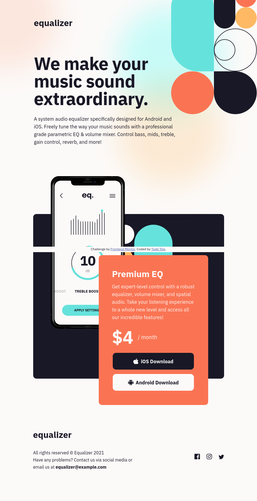

# Frontend Mentor - Equalizer landing page solution

This is a solution to the [Equalizer landing page challenge on Frontend Mentor](https://www.frontendmentor.io/challenges/equalizer-landing-page-7VJ4gp3DE). Frontend Mentor challenges help you improve your coding skills by building realistic projects. 

## Table of contents

- [Overview](#overview)
  - [The challenge](#the-challenge)
  - [Screenshot](#screenshot)
  - [Links](#links)
- [My process](#my-process)
  - [Built with](#built-with)
  - [What I learned](#what-i-learned)
- [Author](#author)
- [Acknowledgments](#acknowledgments)

## Overview

### The challenge

Users should be able to:

- View the optimal layout depending on their device's screen size
- See hover states for interactive elements

### Screenshot

### Links

- Solution URL: https://github.com/toddteis/equalizer-landing-page
- Live Site URL: https://toddteis.github.io/equalizer-landing-page/

## My process

### Built with

- Semantic HTML5 markup
- CSS custom properties
- Flexbox
- Mobile-first workflow

### What I learned

This was the first time I have worked with z-index to get the phone image, background pattern and call to action text section to layer correctly.
I also used position & relative/absolute to position various components in the layout, which I hadn't used before.

## Author

- Website - https://www.toddteis.com
- Frontend Mentor - [@toddteis]https://www.frontendmentor.io/profile/toddteis

## Acknowledgments

A big thank you to Frontend Mentor for providing a great learning tool.
